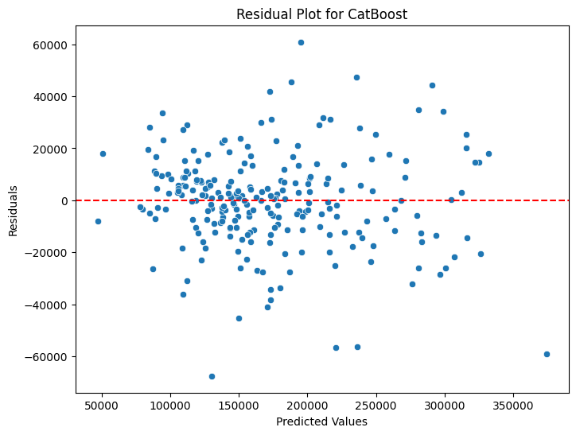

# House Price Prediction Project

## NON-TECHNICAL EXPLANATION OF YOUR PROJECT
This project aims to predict house prices using advanced machine learning models. By analyzing features like location, size, and other property attributes, the goal is to create an accurate, data-driven tool for estimating house values. This can help buyers, sellers, and real estate professionals make informed decisions. The project evaluates different models to identify the best performing algorithm for this task. To follow my process, start in the [Initial Exploration](https://github.com/matthewkarlson/IMP_PCMLAI_Final_Project/blob/main/Initial_exploration.ipynb) file and then move to the [Model Training and Inference](https://github.com/matthewkarlson/IMP_PCMLAI_Final_Project/blob/main/Model_Training_And_Inference.ipynb) file.

## DATA
The dataset includes historical house sale prices and their features, sourced from [Kaggle's House Prices: Advanced Regression Techniques competition](https://www.kaggle.com/c/house-prices-advanced-regression-techniques). Key features include property size, location, and condition. This dataset was preprocessed to handle missing values and anomalies.

## MODEL 
We tested multiple models:
1. **Linear Regression**: Used as a baseline, performed at an acceptable level and served as a good benchmark.
2. **Random Forest Regressor**: Chosen for its robustness and ability to capture non-linear relationships.
3. **XGBoost Regressor**: Selected for its efficiency and superior performance after hyperparameter tuning.
4. **CatBoost**: Performs well on categorical data

## HYPERPARAMETER OPTIMIZATION
Hyperparameters for Random Forest (e.g., number of trees, max depth) and XGBoost (e.g., learning rate, tree depth) were optimized using RandomizedSearchCV. This approach efficiently searched a predefined parameter space to minimize mean absolute error (MAE). 

## RESULTS
- **Linear Regression**: High MAE and RMSE, indicating poor fit to data.
- **Random Forest**: Significant improvement, reducing errors and increasing R².
- **XGBoost**: Best performance with lowest MAE and RMSE, confirmed through cross-validation and validation sets.
- **CatBoost**: I added this in afterwards to see if it would perform better than XGBoost but it didn't initially. I ended up removed some outliers and it turned out to perform the best!

## CONTACT DETAILS
For questions or feedback, feel free to contact me at [hello@mattkarlson.com](mailto:hello@mattkarlson.com).
