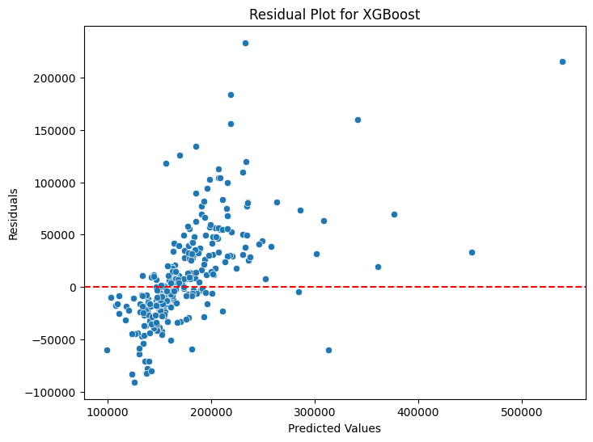

# Model Card: House Price Prediction Model

## Model Description

**Input:**  
The model takes as input a set of property features, including but not limited to:
- Lot area
- Number of bedrooms and bathrooms
- Year built
- Overall quality and condition
- Location-specific features

These features are numerical or categorical and are preprocessed for model training.

**Output:**  
The output is a single numerical value predicting the sale price of the property in dollars.

**Model Architecture:**  
- **Baseline Model:** Linear Regression, used as a benchmark for comparison.  
- **Advanced Models:** Random Forest Regressor and XGBoost Regressor.  
  - **Random Forest Regressor:** An ensemble learning method based on decision trees, robust to outliers and capable of capturing non-linear relationships.  
  - **XGBoost Regressor:** A gradient boosting model optimized for speed and performance, leveraging decision trees and iterative improvements through boosting.

## Performance

**Metrics Used:**
- Mean Absolute Error (MAE)
- Root Mean Squared Error (RMSE)
- R² (coefficient of determination)

**Validation Results:**
- **Linear Regression:**  
  - MAE: High  
  - RMSE: High  
  - R²: Low  
  Poor performance indicates it is not suitable for the dataset.
  
- **Random Forest:**  
  - MAE: Moderate  
  - RMSE: Lower than Linear Regression  
  - R²: High  
  Significant improvement, capturing non-linear relationships.

- **XGBoost:**  
  - MAE: Lowest  
  - RMSE: Lowest  
  - R²: Highest  
  Best performance with well-tuned hyperparameters. Residual plots confirmed minimal bias.

**Visualization:**  
  
Graphical representation of residuals shows improved predictions after handling data anomalies.

## Limitations

- **Data Anomalies:** The dataset contains artifacts, which can skew predictions. Removing these anomalies improves accuracy but reduces training data size.
- **Feature Importance:** The model relies heavily on certain features, and missing or incomplete data for these can reduce performance.
- **Generalizability:** The model is trained on a specific dataset and may not generalize well to other housing markets without retraining.

## Trade-offs

- **Bias vs. Complexity:** While XGBoost outperforms simpler models, it is computationally expensive, making it less suitable for real-time applications compared to Random Forest.
- **Data Preprocessing:** Random Forest and XGBoost do not require extensive normalization, simplifying preprocessing but potentially masking the need for deeper feature engineering.
- **Performance vs. Interpretability:** Advanced models like XGBoost achieve higher accuracy but are harder to interpret compared to simpler models like Linear Regression.

This model is effective for predicting house prices in the given dataset but requires careful consideration of its limitations and trade-offs for deployment in real-world scenarios.
